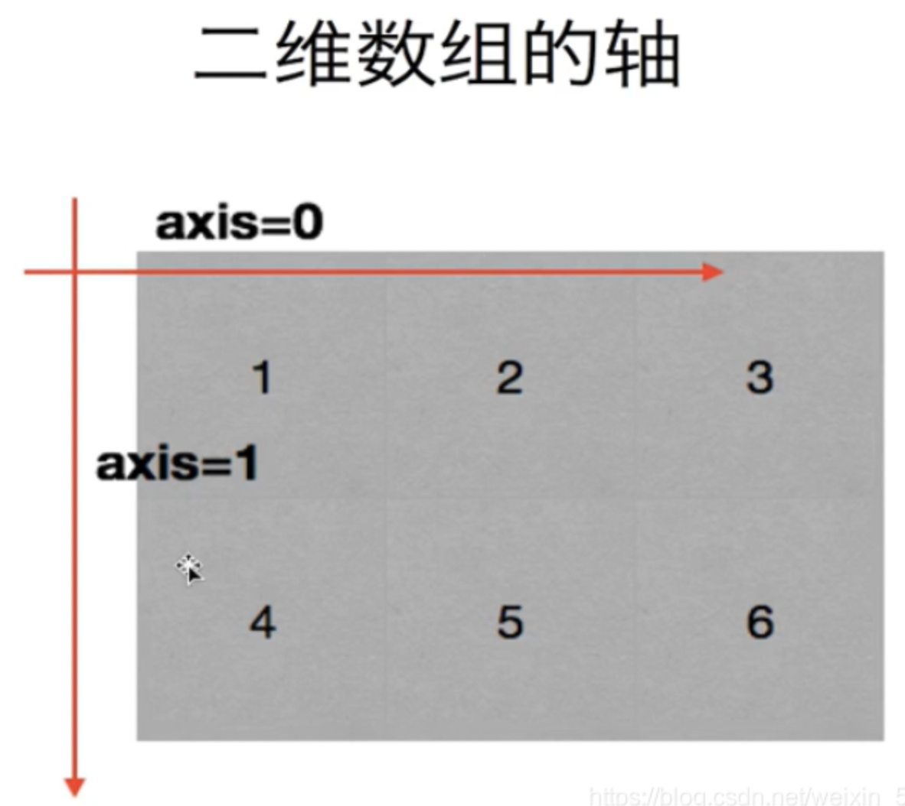
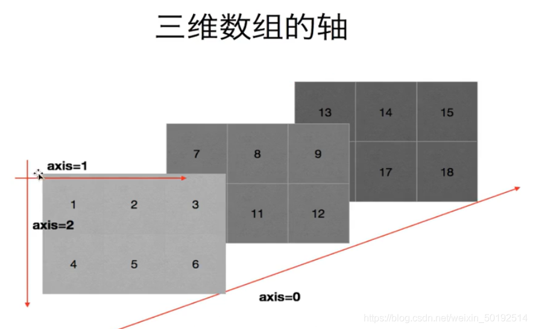

## Numpy的 读取数据

### 轴（axis）
    前面提到的数组 有一维，二维和三维。也可以联想成是一维坐标，二维坐标和三维坐标。 那么轴代表的意义就是坐标轴，一般用0，1，2表示坐标轴
    一维轴用0表示
    二维轴用0表示横轴，1表示纵轴
    三维轴用0表示块轴，1表示横轴，2表示纵轴



## Numpy读取数据
    其实pandas对于读取数据有更多的功能，所以普遍都是使用pandas，但是也需要了解Numby 如何读取CSV（Comma-Separated Value）格式的文件
```python
np.loadtxt（frame，dtype，delimiter,skiprows,usecols,unpack）
```
是读取数据的代码
参数解释：

frame：就是传进去一个路径
dtype：就是保存后的数据类型，默认是float eg：dtype=int
delimiter：分隔字符 默认是空格 eg：delimite = None
skiprows：跳过前几行，一般跳过第一行 eg：skipeows = 0
usecols：读取指定的列，索引元组类型
unpacks： 如果True,就让转置数据反转过来，通俗来讲其实就是行变成列，列变成行。默认是False
